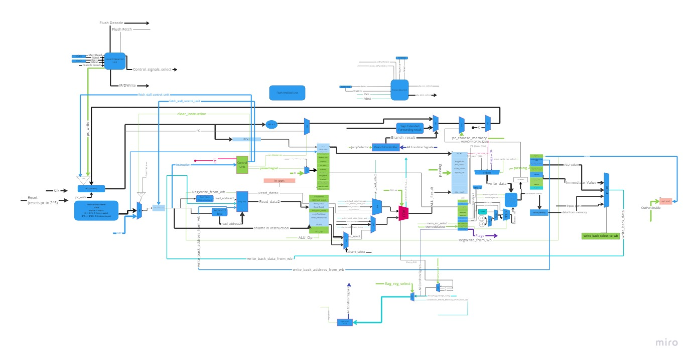

# RISC-Pipelined-Processor

5 stages RISC pipelined processor with multiple instructions implemented including ALU Operations, Interrupts as a state machine, Jumps and branching instructions, Memory operations and more..

## Stages

- Fetch Stage
- Decode Stage
- Execute Stage
- Memory Stage
- Write Back Stage

## Controllers

- Branch Controller
- Hazard Controller

## Units

- ALU
- Forwarding Unit
- Control Unit

## Assembler

An assembler written in python that translates High-Level instructions such as "add r1,r2" to 16 bit binary digits consisting of an opcode, destination register, source register addresses, and extra bits necessary for other instructions like "1001001011110101" so that we can easily decode the given instruction and execute it accordingly.

# Final Integrated Processor

